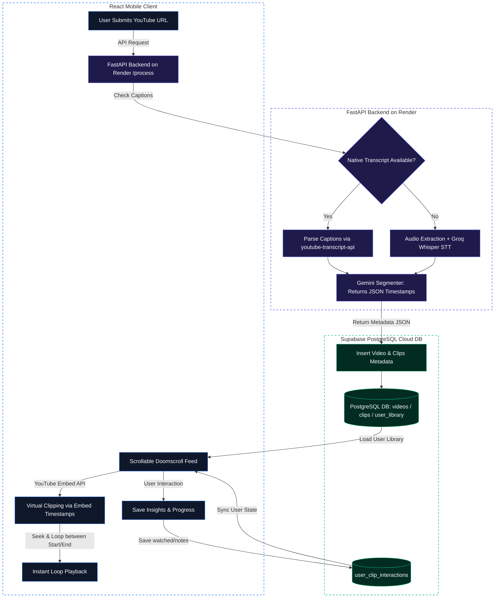

# Udoom (Productive Doomscrolling)

Udoom is an AI-powered web application that turns long-form video consumption (e.g., YouTube lectures, podcasts, or documentaries) into high-yield, vertical "doomscrolling" feeds. It parses long videos into 60-second bite-sized educational clips so you can absorb high-value content instead of short-form brainrot.

---

## Pipeline Architecture

Here is the step-by-step workflow of the core AI pipeline:



---

## Deep Dive: The AI Pipeline

The pipeline is split into four modular steps located in [`server/pipeline/`](file:///Users/teamincredibles/Desktop/Productive%20Doomscrolling/server/pipeline):

1. **Step 1: Ingestion & Caption Retrieval** ([step1_download.py](file:///Users/teamincredibles/Desktop/Productive%20Doomscrolling/server/pipeline/step1_download.py))
   * Attempts to instantly fetch the native English transcripts from YouTube using the `youtube-transcript-api` library (routed through Webshare rotating proxies to bypass blocks).
   * Extracts metadata (title, duration, chapters) using the official YouTube Data API v3, falling back to scraping via `yt-dlp` if no API key is set.
2. **Step 2: Extract & Transcribe** ([step2_transcribe.py](file:///Users/teamincredibles/Desktop/Productive%20Doomscrolling/server/pipeline/step2_transcribe.py))
   * If native transcripts are unavailable, a **Whisper AI Fallback** path can be triggered:
     * Downloads the audio track using `yt-dlp` and uses `ffmpeg` to extract a highly compressed mono MP3 (48kbps) to avoid upload limits.
     * Transcribes the audio using the **Groq Whisper API** (`whisper-large-v3`) with exact sentence-level timestamps.
     * Employs a stitching engine to auto-chunk and reassemble transcripts for long videos exceeding Groq's 25MB file upload limit.
   * *(Note: To save proxy bandwidth, this audio-download/Whisper fallback is currently commented out/disabled by default, making native transcripts a requirement for processing new videos.)*
3. **Step 3: AI Segmentation** ([step3_segment.py](file:///Users/teamincredibles/Desktop/Productive%20Doomscrolling/server/pipeline/step3_segment.py))
   * Feeds transcripts and chapter boundaries to **Google Gemini** using a strict JSON output schema to return precise start/end timestamps.
   * Gemini determines natural boundaries (non-overlapping clips ranging from 60s to 480s).
4. **Step 4: Client-Side Virtual Clipping & Cropping** (Active Web App Path)
   * Rather than rendering static physical files server-side (which is slow and expensive), the production application performs **virtual clipping & cropping** directly on the client.
   * **Virtual Cropping**: Scoped CSS rules on the React client dynamically crop the YouTube IFrame player window (e.g., center-cropping talking heads for `vertical_crop` or sizing it for `letterbox`) according to Users selection.
   * **Virtual Clipping**: A heartbeat thread monitors player time via the YouTube Embed player API. Once the elapsed time hits the clip's JSON-defined `end` timestamp, the player instantly loops back to the `start` timestamp.

---

## Tech Stack & Infrastructure

* **Frontend**: React + Vite + Tailwind CSS (Mobile-First responsive UI)
* **Backend**: FastAPI (Python) hosted on **Render**
* **Auth & DB**: Supabase (PostgreSQL with strict Row Level Security)
* **Payment Processing**: Paddle v2 Sandbox integration (custom webhooks and automatic monthly usage resets)
* **Video Automation**: `ffmpeg`, `yt-dlp`, and `verbose_json` Groq-Whisper transcript stitching.
* **Api**: `youtube-transcript-api`, official YouTube Data API v3, Gemini, Groq Whisper, Webshare.

---

## Getting Started

### Prerequisites
* Python 3.10+
* Node.js 18+
* FFmpeg installed locally (`brew install ffmpeg` on macOS)

### 1. Backend Setup
```bash
# Navigate to the workspace and create a virtual environment
python3 -m venv venv
source venv/bin/activate

# Install requirements
pip install -r requirements.txt

# Setup your local configuration
cp .env.example .env
```
Fill out the keys in your newly created `.env` (Gemini, Groq, Supabase URL/Key).

Start the FastAPI application:
```bash
python server/main.py
```

### 2. Frontend Setup
```bash
# Navigate to client directory
cd client

# Install dependencies
npm install

# Run React in local development
npm run dev
```
Open `http://localhost:5173` in your browser.
