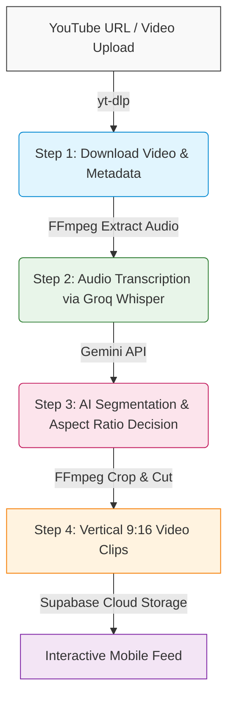

# 🚀 Udoom (Productive Doomscrolling)

Udoom is an AI-powered web application that turns long-form video consumption (e.g., YouTube lectures, podcasts, or documentaries) into high-yield, vertical "doomscrolling" feeds. It parses long videos into 60-second bite-sized educational clips so you can absorb high-value content instead of short-form brainrot.

---

## 📐 Pipeline Architecture

Here is the step-by-step workflow of the core AI pipeline:



---

## 🛠️ Deep Dive: The AI Pipeline

The pipeline is split into four modular steps located in [`server/pipeline/`](file:///Users/teamincredibles/Desktop/Productive%20Doomscrolling/server/pipeline):

1. **Step 1: Download & Ingestion** ([step1_download.py](file:///Users/teamincredibles/Desktop/Productive%20Doomscrolling/server/pipeline/step1_download.py))
   * Downloads the raw video using `yt-dlp` in a fast-seeking format.
   * Downloads YouTube chapter markers for better contextual mapping.
2. **Step 2: Extract & Transcribe** ([step2_transcribe.py](file:///Users/teamincredibles/Desktop/Productive%20Doomscrolling/server/pipeline/step2_transcribe.py))
   * Uses `ffmpeg` to strip the video and extract highly compressed audio (48kbps mono MP3) to avoid API request payload limits.
   * Uses the **Groq Whisper API** (`whisper-large-v3`) to generate transcripts with exact timestamps.
   * Includes a stitching engine to automatically handle and transcribe files longer than Whisper's 25MB threshold.
3. **Step 3: AI Segmentation** ([step3_segment.py](file:///Users/teamincredibles/Desktop/Productive%20Doomscrolling/server/pipeline/step3_segment.py))
   * Feeds transcripts and chapter boundaries to **Google Gemini** using a strict JSON output schema.
   * Gemini determines natural boundaries (non-overlapping clips ranging from 60s to 480s) and identifies a unified optimal aspect ratio for the clips.
4. **Step 4: Multi-Ratio Clipping** ([step4_clip.py](file:///Users/teamincredibles/Desktop/Productive%20Doomscrolling/server/pipeline/step4_clip.py))
   * Uses `ffmpeg` with fast seeking to crop and stitch clips.
   * Dynamically applies the chosen aspect ratio filter:
     * `vertical_crop` (16:9 ➔ 9:16 center-crop for talking heads)
     * `letterbox` (box scaling with padding for presentations/slides)
     * `square` (1:1 crop)
     * `original` (leaves vertical format intact)

---

## 💻 Tech Stack & Infrastructure

* **Frontend**: React + Vite + Tailwind CSS (Mobile-First responsive UI)
* **Backend**: FastAPI (Python)
* **Auth & DB**: Supabase (PostgreSQL with strict Row Level Security)
* **Payment Processing**: Paddle v2 Sandbox integration (custom webhooks and automatic monthly usage resets)
* **Video Automation**: `ffmpeg`, `yt-dlp`, and `verbose_json` Groq-Whisper transcript stitching.

---

## 🚀 Getting Started

### Prerequisites
* Python 3.10+
* Node.js 18+
* FFmpeg installed locally (`brew install ffmpeg` on macOS)

### 1. Backend Setup
```bash
# Navigate to the workspace and create a virtual environment
python3 -m venv venv
source venv/bin/activate

# Install requirements
pip install -r requirements.txt

# Setup your local configuration
cp .env.example .env
```
Fill out the keys in your newly created `.env` (Gemini, Groq, Supabase URL/Key).

Start the FastAPI application:
```bash
python server/main.py
```

### 2. Frontend Setup
```bash
# Navigate to client directory
cd client

# Install dependencies
npm install

# Run React in local development
npm run dev
```
Open `http://localhost:5173` in your browser.
